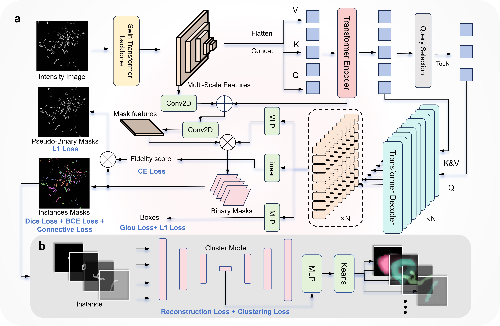
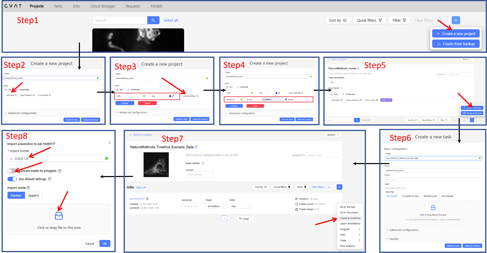

# PanoMito

PanoMito is a comprehensive toolbox for mitochondrial analysis that includes the PanoMitoAtlas dataset with over 160,000 annotated instances, the PanoMitoSeg segmentation tool, the PanoMitoCluster clustering module, and integrated analysis pipelines. The toolbox is optimized for custom datasets and works with microscopy images of arbitrary sizes. For installation instructions, please see the guide below. Detailed methodology and usage examples are available on the [PanoMito website](http://www.panomito.com/).

<p align="center">
  
</p>

# ⚙️ Installation


You can install PanoMito using conda or native python.

### 1. System requirements

The system has been tested on Ubuntu 20.04 and 22.04 with NVIDIA GeForce RTX 3090 (24 GB VRAM) and RTX 5090 (32 GB VRAM) GPUs. A minimum of 16GB VRAM is required for inference on 512×512 images, while larger image sizes may demand additional memory capacity.

### 2. Step-by-Step Setup

#### 2.1 Clone the repository

First, clone this repository to your local machine:

```bash
git clone https://github.com/DCILab2024/PanoMito.git
cd PanoMito
```

#### 2.2 External repositories (`detectron2`, `Deformable-DETR`)

These folders are **not** part of this Git repository (they are listed in `.gitignore`). Clone them at the **repository root** (`./`) before the conda/pip steps:

```bash
git clone git@github.com:facebookresearch/detectron2.git
git clone git@github.com:fundamentalvision/Deformable-DETR.git
```

#### 2.3 Create environment and install dependencies

🟢 create conda environment

```bash
conda create --name PanoMito_demo python=3.9.21
conda activate PanoMito_demo
```

🔵 install pytorch

Choose the installation command that matches your GPU and driver. The table below lists **two tested cases** that we have verified on our machines:

| | **Case 1** | **Case 2** |
|---|---|---|
| **OS** | Ubuntu 20.04 | Ubuntu 22.04 |
| **GPU** | NVIDIA GeForce RTX 3090 (24 GB) | NVIDIA GeForce RTX 5090 (32 GB) |
| **Driver** | 535.230.02 | 575.64.05 |
| **CUDA (driver)** | 12.2 | 12.9 |
| **Install PyTorch** | `conda install pytorch=1.12.0 torchvision=0.13.0 torchaudio=0.12.0 cudatoolkit=11.3 -c pytorch` | `pip3 install torch torchvision --index-url https://download.pytorch.org/whl/cu128` |
| **Install CUDA toolkit** | *(bundled via `cudatoolkit=11.3` above)* | `conda install -c "nvidia/label/cuda-12.8.0" cuda-toolkit` |

**Case 1** (RTX 3090):

```bash
conda install pytorch=1.12.0 torchvision=0.13.0 torchaudio=0.12.0 cudatoolkit=11.3 -c pytorch
```

**Case 2** (RTX 5090):

```bash
pip3 install torch torchvision --index-url https://download.pytorch.org/whl/cu128
conda install -c "nvidia/label/cuda-12.8.0" cuda-toolkit
```

> **Other hardware:** If your GPU model, driver, or CUDA version differs, visit the [PyTorch official website](https://pytorch.org/get-started/locally/) to select the matching install command for your system.

🟡 install requirements

```bash
pip install -r requirements.txt
```

🟡 install detectron2

```bash
cd detectron2
pip install --no-build-isolation --config-settings editable_mode=compat -e .
```

🟠 Compile Deformable-DETR CUDA operators (expects `Deformable-DETR/` at the repo root)

Before compiling, make sure **`nvcc` is installed** and on your `PATH` (verify with `nvcc --version`). Also confirm that your **GCC version is compatible with your CUDA toolkit**—mismatched versions are a common cause of build failures. See the [CUDA–GCC compatibility table](https://docs.nvidia.com/cuda/cuda-installation-guide-linux/index.html#system-requirements) for supported combinations.

```bash
cd ..
cd Deformable-DETR
cd ./models/ops
sh ./make.sh
```

# 📦 Resources


Open resources for reproducing our results: datasets, trained models, and pretrained weights. Download everything from Zenodo.

### 1. PanoMitoAtlas

The PanoMitoAtlas dataset (130,000+ annotated mitochondrial instances) is available on [Zenodo](https://zenodo.org/records/21129338). See the [PanoMito website](http://www.panomito.com/) for dataset details and citation information.

The bundle includes 2D images, time-lapse images, and their corresponding annotations in COCO format, as well as the training and test splits used in this study, so researchers can reproduce our experiments and use the dataset for future work.

**Download and setup**

1. Download `PanoMitoAtlas.zip` from [Zenodo](https://zenodo.org/records/21129338) and extract it.
2. **Reproduce our results:** copy the contents of `train_test_subset/` into `./data/` (training split under `./data/train/`, test split under `./data/test/`). This provides the same train/test partition used in the paper.
3. **Custom train/test split:** if you want a different split ratio, use the COCO annotations under `all_2d_dataset/` in `PanoMitoAtlas.zip`. Follow the workflow in [`data_pre.py`](data_pre.py):
   - `split_coco_dataset_traintest()` — split a COCO JSON into `_train.json` and `_test.json`
   - `coco2npy_rle()` — convert JSON annotations to RLE-encoded `.npy` files for `train.py`

### 2. Models

Trained model weights are available individually on [Zenodo](https://zenodo.org/records/20959653).


| File                  | Role                                                                                   |
| --------------------- | -------------------------------------------------------------------------------------- |
| `PanoMitoSeg.pth`     | **Segmentation model**                                                                 |
| `PanoMitoCluster.pth` | **Clustering model**                                                                   |
| `cellpose_model`      | **Cellpose baseline** — custom Cellpose model for comparison in `cellpose_benchmark/`. |


**Download and setup**

1. Download the three files listed above from [Zenodo](https://zenodo.org/records/20959653).
2. Place them in `./MODEL/`.

### 3. Pretrain weights

This checkpoint provides the **initialization weights** for fine-tuning PanoMitoSeg (`train.py`). It is not the final segmentation model used for inference — `PanoMitoSeg.pth` in `./MODEL/`. The weights were pretrained on **[TissueNet](https://tissuenet.org/)**, a multi-tissue microscopy instance-segmentation dataset. Training on diverse tissue images gives PanoMitoSeg a strong starting point for mitochondrial instance segmentation, improving convergence and stability when fine-tuning on PanoMito training data.

**Download and setup**

1. Download `tissuenet_model_0019999.pth` from [Zenodo](https://zenodo.org/records/20959653).
2. Place the file in `./pretrain_model/`.

# 🚀 Usage


Complete the installation steps above before use. All commands below are run from the **repository root**.

PanoMito provides two core entry points at the repository root (`train.py`, `predict.py`) and two example workflows under `demo/` that build on the prediction pipeline.


| Entry point     | Command                                   | Description                        |
| --------------- | ----------------------------------------- | ---------------------------------- |
| **Train**       | `python train.py`                         | Fine-tune the segmentation model   |
| **Predict**     | `python predict.py`                       | Run segmentation inference         |
| Benchmark demo  | `python demo/panomito_benchmark.py`       | Predict + ground-truth evaluation  |
| Clustering demo | `python demo/predict_cluster_analysis.py` | Predict + morphological clustering |


## Core workflows


### 1. Train — `train.py`

Fine-tune PanoMitoSeg on annotated training data.

`train.py` reads RLE-encoded `.npy` annotations, but the raw releases are in **COCO JSON** format. Use [`data_pre.py`](data_pre.py) to convert them before training.

**Step 1 — Prepare images and JSON under `./data/`**

Follow [§1 PanoMitoAtlas](#1-panomitoatlas) to download and place files under `./data/train/` and `./data/test/`.

**Step 2 — Convert JSON to `.npy` (choose one path)**

**A. Our pre-split sets (reproduce paper results)**

If you copied `train_test_subset/` from `PanoMitoAtlas.zip` into `./data/`, the train/test partition is already fixed. You only need the JSON-to-NPY step:

1. Ensure `./data/train/_train_subdataset_gt.json` and `./data/test/_test_subdataset_gt.json` are present (with matching PNG images in the same folders).
2. Run `python data_pre.py` — by default it calls `coco2npy_rle()` on these two files.
3. This produces `./data/train/_train_subdataset_gt_nocate_rle.npy` and `./data/test/_test_subdataset_gt_nocate_rle.npy`, which `train.py` loads directly.

**B. Custom train/test split**

If you want a new split ratio (e.g. from `all_2d_dataset/` in `PanoMitoAtlas.zip`, or your own COCO file):

1. Call `split_coco_dataset_traintest(coco_path, output_dir, train_ratio=0.7)` in `data_pre.py` to write `_train.json` and `_test.json`.
2. Place the corresponding images and JSON files under `./data/train/` and `./data/test/`.
3. Run `coco2npy_rle()` (via `python data_pre.py` after updating the paths in `if __name__ == "__main__":`) to generate the `_nocate_rle.npy` files expected by `train.py`.

**Step 3 — Start fine-tuning**

```bash
python train.py
```

**Input**

- **Dataset:** RLE-encoded `.npy` files under `./data/train/` and `./data/test/`
- **Pretrained weights:** `./pretrain_model/tissuenet_model_0019999.pth`

**Output** (under `./output/train/`)

- `config.yaml` — snapshot of the full training configuration used for this run (model, solver, data paths, loss weights)
- `log.txt` — text log with iteration losses, learning rate, evaluation AP/AR, and timestamps
- `metrics.json` — training metrics in JSON (per-iteration loss, data time, iteration time); useful for plotting curves
- `events.out.tfevents.*` — TensorBoard event files; view with `tensorboard --logdir output/train`
- `model_0004999.pth`, `model_0009999.pth`, … — periodic checkpoints saved every 5,000 iterations (`CHECKPOINT_PERIOD=5000`)
- `model_final.pth` — final model weights at the end of training (iteration 20,000)
- `last_checkpoint` — pointer file to the most recently saved checkpoint (used for resume)
- `inference/coco_instances_results.json` — COCO-format instance segmentation predictions on the test set (`mito_test`); used to compute AP/AR during training

Evaluation metrics (bbox AP, segm AP, etc.) are printed to the terminal and recorded in `log.txt` at each evaluation step.

### 2. Predict — `predict.py`

Run tiled segmentation inference on microscopy images.

```bash
python predict.py
```

**Input**

- **Images:** `./data/test/` (PNG)
- **Model:** `./MODEL/PanoMitoSeg.pth`

**Output**

- `./results/predict_results/_sub_predictor_use_NMS_dataset=all_merge_thresh=0.4_c=0.0_merge_q300.json` — COCO-format instance segmentation results

Default inference settings: tile size 512, `merge_thresh=0.4`, NMS post-processing. Edit the arguments in `if __name__ == "__main__":`, or call `run_panomito_predict()` to customize parameters.

## Demo workflows


Example end-to-end pipelines under `demo/`. Both demos call the same prediction logic as `predict.py`, then run additional analysis steps. See `[demo/README.md](demo/README.md)` for a step-by-step walkthrough.

```bash
python demo/<script_name>.py
```

### 1. Benchmark — `demo/panomito_benchmark.py`

Segmentation benchmark with ground-truth evaluation (AP, AR, F1).

```bash
python demo/panomito_benchmark.py
```

**Input**

- **Images:** `./data/test/` (PNG)
- **Ground truth:** `./data/test/_test_subdataset_gt.json`
- **Model:** `./MODEL/PanoMitoSeg.pth`

**Output** (under `./results/panomito_benchmark/`)

- `_sub_predictor_use_NMS_dataset=all_merge_thresh=0.4_c=0.0_merge_q300.json` — COCO-format predictions
- `_sub_predictor_use_NMS_dataset=all_merge_thresh=0.4_c=0.0_adjust_id.json` — predictions with IDs aligned to ground truth
- Evaluation metrics printed to the terminal
- Sample visualizations in `visualization/`
- Timestamped log: `panomito_benchmark_YYYYMMDD_HHMMSS.txt`

### 2. Clustering — `demo/predict_cluster_analysis.py`

Segmentation followed by morphological clustering and morphology class assignment.

**Pipeline steps:** segmentation → instance mask export → K-means clustering (K=12) → morphology classification summary.

```bash
python demo/predict_cluster_analysis.py
```

**Input**

- **Images:** `./data/test/` (PNG)
- **Models:** `./MODEL/PanoMitoSeg.pth`, `./MODEL/PanoMitoCluster.pth`

**Output** (under `./results/predict_cluster_analysis/`)

**Root directory**

- `_sub_predictor_use_NMS_dataset=all_merge_thresh=0.4_c=0.0_merge_q300.json` — COCO-format segmentation results
- `predict_cluster_analysis_instance_metrics.csv` — per-instance morphology metrics (with morphology class labels)
- `predict_cluster_analysis_cluster_summary.csv` — per-cluster mean metrics and morphology class assignment; **this is the final morphology class result**

**MitoInstance/**

- `{annotation_id:06d}_all_data.png` — per-instance 255×255 binary mask crops
- `all_z_np.npy` — autoencoder latent features used for clustering

**Cluster/**

- `mito_clusters.csv` — filename-to-cluster mapping (K-means labels 0–11)
- `clustering_umap.png` — 2D UMAP visualization of cluster embeddings
- `KmeansLabelRefine_0/` … `KmeansLabelRefine_11/` — intermediate clustering outputs: instance masks grouped by K-means cluster, used to extract per-cluster metrics and as input for morphology classification (not the final morphology class result)

# 👁️ Visualization

PanoMito prediction results are saved in COCO-style JSON format and can be visualized interactively using [CVAT](https://www.cvat.ai/). This is useful for inspecting predicted mitochondrial instance masks, comparing predictions with manual annotations, and reviewing segmentation quality on custom datasets.

### 1. Prepare images and annotation files

Before visualization, make sure that the image files and the COCO-format JSON file use consistent file names. For example, if the prediction JSON contains an image entry named `sample_001.png`, the corresponding image file uploaded to CVAT should have the same name.

Typical files for visualization include:

| File | Description |
| --- | --- |
| `./data/test/*.png` | Input microscopy images |
| `./results/predict_results/*_merge_q300.json` | PanoMitoSeg prediction results in COCO format |


### 2. CVAT workflow

Follow the numbered steps in the figure below to create a project, upload images, and import PanoMito predictions.

<p align="center">
  
</p>

| Step | Action |
| --- | --- |
| **1** | On the CVAT home page, click **+** and select **Create new project**. |
| **2** | Enter a project name (e.g. `PanoMito`). |
| **3** | Under **Labels**, add a label named **`Mito`** — use the same name as in your COCO prediction/annotation JSON. |
| **4** | Optionally add label attributes (e.g. `instance_id`); this is not required for basic visualization. Click **Submit & Open**. |
| **5** | From the project page, click **+** and select **Create new task**. |
| **6** | Enter a task name, select the project created above (the `Mito` label is inherited automatically), and upload microscopy images under **Select files** → **My computer**. File names must match those in the COCO JSON (see [§1](#1-prepare-images-and-annotation-files)). Click **Submit & Open**. |
| **7** | Open the task, then click **Actions** → **Import annotations** on the job row. |
| **8** | Select **COCO 1.0**, keep **Convert masks to polygons** off (PanoMito outputs mask annotations), upload the prediction or ground-truth JSON, and click **OK**. Refresh the task if masks are not immediately displayed. |

The predicted mitochondrial instances should then appear as mask annotations overlaid on the original microscopy images.

### 3. Recommended use cases

CVAT visualization can be used to:

- inspect PanoMitoSeg instance masks on custom images;
- compare predicted masks with manual annotations;
- identify merged, fragmented, missed, or duplicate mitochondrial instances;
- prepare corrected annotations for additional fine-tuning;
- review difficult cases such as densely packed or intertwined mitochondrial networks.


## Acknowledgement

Many thanks to these projects:

- [Detectron2](https://github.com/facebookresearch/detectron2)
- [Mask DINO](https://github.com/IDEA-Research/MaskDINO)
- [Deformable-DETR](https://github.com/fundamentalvision/Deformable-DETR)
